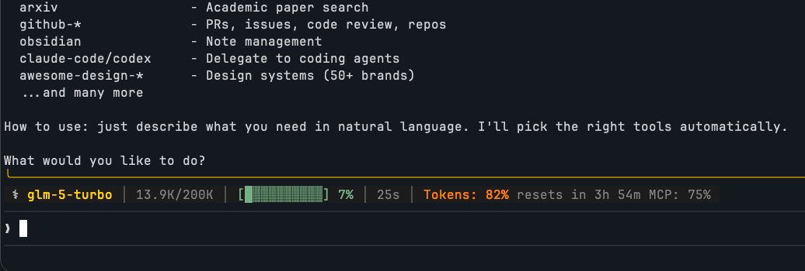

# glm-coding-plan-status-hermes

> Z.AI / Zhipu AI Coding Plan usage monitor plugin for [Hermes Agent](https://github.com/emcie-co/hermes-agent)



Real-time usage status bar for Z.AI (Zhipu AI) Coding Plan subscribers. Displays token quota, MCP usage, estimated cost, and model info in a Claude Code-style status bar.

Converted from [glm-coding-plan-statusline](https://github.com/jeongsk/glm-coding-plan-statusline) (by @jeongsk) to Hermes plugin format.

## Features

- **Real-time usage monitoring** - Token and MCP quota updated every 60 seconds with smart caching
- **Auto status bar** - Usage info automatically injected into every assistant response via `pre_llm_call` hook
- **On-demand query** - Use the `zai_usage` tool to get a colorful ANSI status bar anytime
- **Zero dependencies** - Pure Python stdlib (urllib, json, pathlib)
- **Multiple platforms** - Supports Z.AI (`api.z.ai`), Zhipu AI (`open.bigmodel.cn`), and dev (`dev.bigmodel.cn`)
- **Cost estimation** - Estimates cost based on token usage (input: $3/M, output: $15/M)
- **Reset countdown** - Shows time until next quota reset
- **Claude Code-style design** - Colorful ANSI progress bars and layout matching Claude Code's status line

## Prerequisites

- [Hermes Agent](https://github.com/emcie-co/hermes-agent) installed and configured
- Z.AI / Zhipu AI Coding Plan subscription
- API credentials configured in Hermes (see below)

## Installation

### Option 1: Clone directly into plugins directory

```bash
cd ~/.hermes/plugins
git clone https://github.com/wanghanlele12345/glm-coding-plan-status-hermes.git zai-statusline
```

### Option 2: Manual copy

```bash
mkdir -p ~/.hermes/plugins/zai-statusline
# Copy all .py files, plugin.yaml into this directory
```

## Configuration

The plugin reads credentials from your existing Hermes configuration. Make sure your `~/.hermes/config.yaml` or `.env` file has:

```yaml
# In ~/.hermes/config.yaml
providers:
  zai:
    base_url: "https://api.z.ai/api/anthropic"
    auth_token: "your-api-token-here"
```

Or via environment variables:

```bash
export ANTHROPIC_BASE_URL="https://api.z.ai/api/anthropic"
export ANTHROPIC_AUTH_TOKEN="your-api-token-here"
```

The plugin also checks Claude Code settings files as fallback:
- `.claude/settings.local.json`
- `.claude/settings.json`
- `~/.claude/settings.json`

## Usage

### Automatic (Recommended)

Once installed, the status bar appears automatically at the beginning of every assistant response:

```
[Status: GLM-5 Turbo Tokens: 75% resets in 3h 56m MCP: 75%]
```

### On-Demand Tool

You can also ask the agent to show the full colorful status bar:

> "Show my usage status"

Or the agent can call the `zai_usage` tool directly, which outputs:

```
 │ ▶ GLM-5 Turbo │ Tokens: ████████░░ 79% (Resets in 3h 56m) │ MCP: 75%
 │ ▶ my-project ≡ main │ $0.42
```

## Plugin Structure

```
zai-statusline/
├── plugin.yaml        # Plugin manifest (name, version, hooks, tools)
├── __init__.py        # Entry point: register(ctx) - tools + hooks
├── api_client.py      # Z.AI API client: quota, model usage, tool usage
├── formatting.py      # ANSI colors, progress bars, status line rendering
├── model_mapper.py    # Claude/Anthropic model name → GLM model name mapping
└── README.md
```

## How It Works

1. **pre_llm_call hook** - Before each LLM call, the plugin fetches usage data from the Z.AI monitoring API and injects a status line into the user message
2. **zai_usage tool** - Registered as an on-demand tool for manual status checks with full ANSI formatting
3. **Caching** - API responses are cached for 60 seconds (success) or 15 seconds (failure) to avoid rate limits
4. **Auto-credentials** - Reads API tokens from environment variables, Hermes config, or Claude Code settings

## Supported API Endpoints

| Platform | Domain |
|----------|--------|
| Z.AI | `api.z.ai` |
| Zhipu AI | `open.bigmodel.cn` |
| Zhipu Dev | `dev.bigmodel.cn` |

## Caching

Usage data is cached at `~/.hermes/zai-usage-cache.json`:
- **Success**: 60 second TTL
- **Failure**: 15 second TTL (fast retry)

## Troubleshooting

### Status bar not showing

1. Check that the plugin is loaded: `hermes plugins list`
2. Verify your API credentials are set (see Configuration above)
3. Check Hermes logs: `~/.hermes/logs/` for any plugin errors
4. Ensure `ANTHROPIC_BASE_URL` points to a supported domain

### API errors / SSL issues

If you see SSL or connection errors, the plugin gracefully falls back and shows "Loading usage data...". This is usually a transient network issue - the cache will retry automatically.

### Status bar disappears mid-conversation

This can happen if the LLM decides not to echo the injected context. The plugin includes a directive instruction to minimize this, but it's a limitation of the prompt-injection approach. Use the `zai_usage` tool for guaranteed display.

## Credits

- Original [glm-coding-plan-statusline](https://github.com/jeongsk/glm-coding-plan-statusline) by @jeongsk - Claude Code plugin for Z.AI usage monitoring
- Converted to Hermes plugin format for [Hermes Agent](https://github.com/emcie-co/hermes-agent)

## License

MIT
